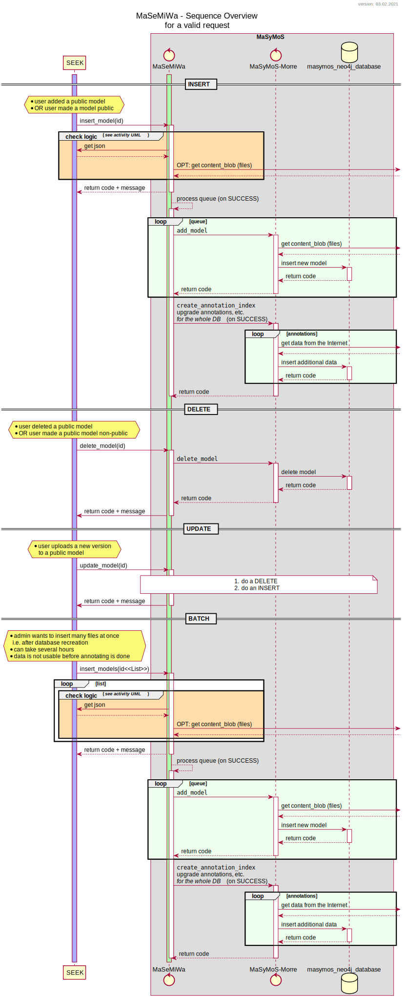

.. _dev_concept:

******************
Middleware Concept
******************

.. include:: rst_directives.rst

.. contents:: 
    :local:

Instead of let SEEK talk directly to MaSyMoS-Morre or vice versa, a middleware could simplify this job by…
    - knowing enough SEEK-API (i.e. where to get the new version)
    - knowing how to deal with MaSyMoS-Morre (i.e. wait with the annotation indexing on bulk-imports; use more threads)

The middleware is für INSERT, UPDATE, DELETE.

MaSyMoS-Morre is used as query tool by SEEK.

Requirements
############

Requirements - MaSyMoS
======================

- MaSyMoS needs an permalink (unique, never changing identifier) per model and version 
    - mandatory for update, delete
    - given with
        - SEEK id+version, i.e. https://fairdomhub.org/models/20.json
        - SEEK meta.uuid as unique identifier
    - json also provides version history and version-comments
- MaSyMoS needs an information on
    - ``INSERT``: link to model without version
    - ``UPDATE``: link to model without version (MaSyMoS deletes old version, then inserts new version)
    - ``DELETE``: link to model without version
- SEEK json key ``latest_version`` needs to point to the current version used by MaSyMoS
- bulk-import to create/reset the MaSyMoS-database
    - list of all available model-URLs

Process description
===================

